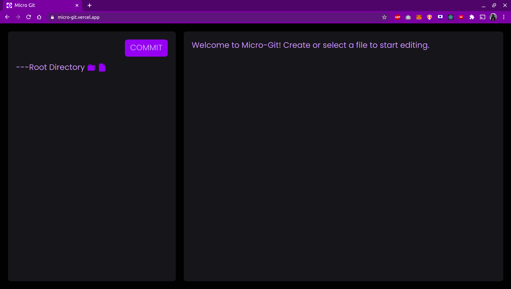
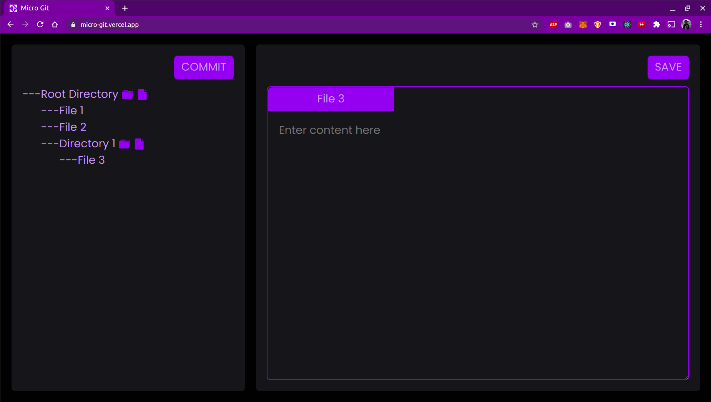
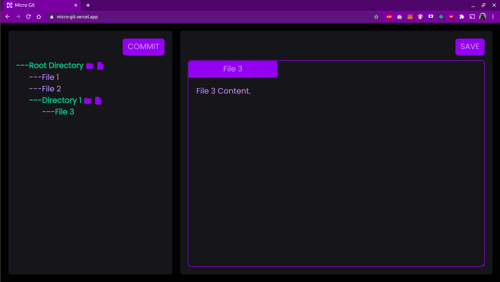

# MICRO-GIT

A fun side project to demonstrate how Merkle Trees can be used to track file changes in version control systems like Git.

# Screenshots

Initial Page

After Adding Files

After Changing Some Content

# Deployment

Find the deployed version of the app here:- https://micro-git.vercel.app/
